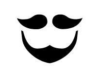
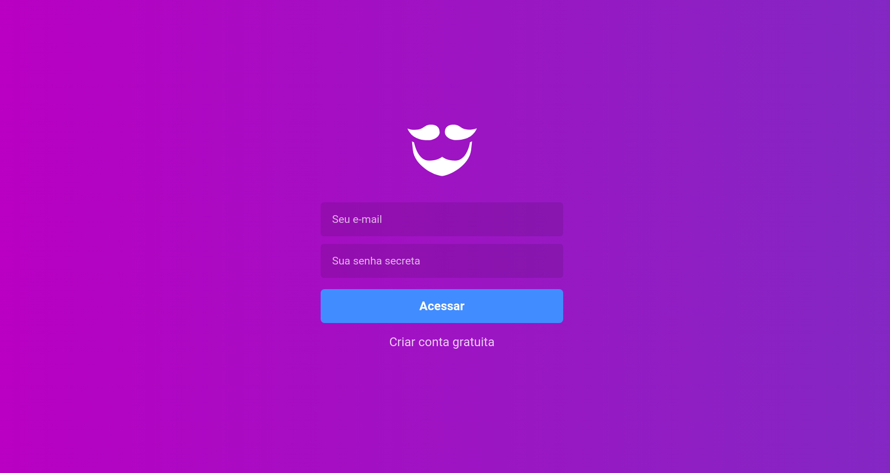
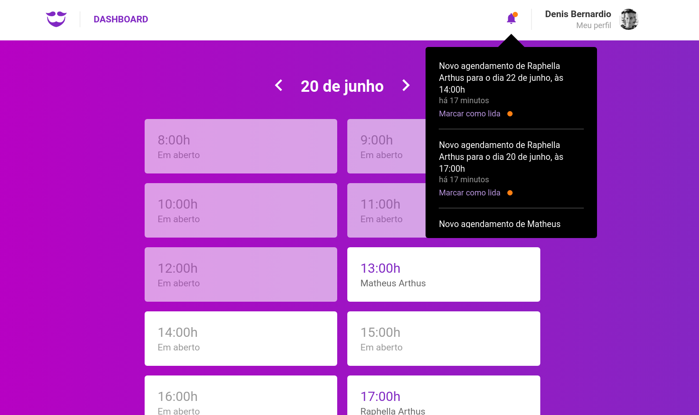

<h1 align="center">
  
</h1>

<h3 align="center">
  GoBarber
</h3>

Esse projeto foi desenvolvido ao longo do Bootcamp GoStack 10 e constitui de uma aplicação completa (Back-end, Front-end e Mobile) de gerenciamento de prestação de serviços de uma barbearia fictícia.

## Sobre o desafio

**GoBarber** é uma aplicação de gerenciamento de serviços de barbearia, onde os prestadores cadastram os seus perfis, via web, e os clientes solicitam e agendam os serviços em um aplicativo mobile. 

Na aplicação Web os prestadores de serviço cadastram seus perfis e também visualizam a sua agenda completa, com todos os horários agendados. Nesse dashboard o prestador recebe notificações dos novos agendamentos no cabeçalho, além de ser notificado também por e-mail. 

No aplicativo mobile, os clientes conseguem agendar um serviço com todos os prestadores disponíveis na plataforma e também, cancelar os agendamentos se assim desejarem.

## Tecnologias

Esse projeto foi desenvolvido com as seguintes tecnologias:

- [Node.js](https://nodejs.org/en/)
- [React](https://reactjs.org)
- [React Native](https://facebook.github.io/react-native/)

**API RESTful** desenvolvida em ​ **Node.js** e **Express.js** com arquitetura ​ MVL​ , para servir a aplicação. Foi utilizado ​ Docker para executar containeres de três bancos distintos: ​ **Postgres** (relacional para as informações gerais de usuário), **MongoDB** (não relacional para as notificações) e ​ **Redis** (para gerenciar a fila de e-mails); ​ **Sequelize** como ORM para a criação das tabelas e realização de consultas; validação de dados de entrada com ​ **Yup**​; ​ **bcryptjs** ​ para gerar hash de password​; teste de envio de e-mails com ​ Nodemailer; rota de autenticação com estratégia JWT​.

Aplicação web para a interface dos prestadores de serviço com ​ **ReactJS**​ . Feita com arquitetura **Flux**​ , através das libs ​ **Redux** e ​ **Redux Saga​**; ​ **Styled Component** na utilização do CSS para estilização; Proptypes para validação dos componentes; ​ **Axios** para acessar a API; usando React Hooks​; e ​**Reactotron** para debug.

Aplicação mobile com ​ **React Native** para a interface dos clientes. Também feita com
arquitetura ​ Flux​ , através das libs ​ Redux e ​ Redux Saga​ ; ​ Proptypes para validação dos componentes; ​ Axios para acessar a API; ​React Hooks​; e layout responsivo.

## Resultado:

MOBILE:

  

WEB:

  

  

## Back-end

Para executar o back-end é preciso acessar, via terminal, a pasta `backend` e seguir os seguintes passos:

**1.** Criar containers de Postgres e Redis no Docker, com os comandos:

`docker run --name db_fastfeet -e POSTGRES_PASSWORD=docker -p 5433:5432 -d postgres`

e

`docker run --name mongobarber -p 27017:27017 -d -t mongo`

e

`docker run --name redisfastfeet -p 6380:6379 -d -t redis:alpine`

**2.** Iniciar bancos de dados no Docker, com o comando: 

`docker start db_fastfeet redisfastfeet`

**3.** Gerar as tabelas no banco de dados, através das migrations e seeds do Sequelize, com os comandos:

`yarn sequelize db:migrate` e `yarn sequelize db:seed:all`

**4.** Configurar o MailTrap no arquivo `web/src/config/mail.js` com o `user` e `pass` da sua conta.

**5.** Finalmente, executar o comando `yarn dev` para rodar a api.

## Web

Para executar a aplicação web você deve acessar, via terminal, a pasta `web` e executar: `yarn start`.

## Mobile (somente Android)

Para executar a aplicação Mobile você deve acessar, via terminal, a pasta `mobile` e seguir os seguintes passos:

**1.** Configurar o arquivo `mobile/src/services/api.js` com ip correto (vide observações abaixo) para que a aplicação consiga acessar a api.

**Obs1:** Se você for rodar a aplicação no AndroidStudio, o ip deve ser `'10.0.0.2'`; se for no geneMotion, `'10.0.3.2'`; e se for com o aparelho físico via usb, deve ser o ip da sua máquina.

**Obs2:** Se a aplicação não estiver conseguindo acessar a api, faça o remapeamento de porta com o comando: `adb reverse tcp:3334 tcp:3334`.

**2.** Agora rode o Metro Bundler com o comando `yarn start --reset-cache`.

**3.** Em outra aba do terminal, instale a aplicação com o comando `react-native run-android`.

